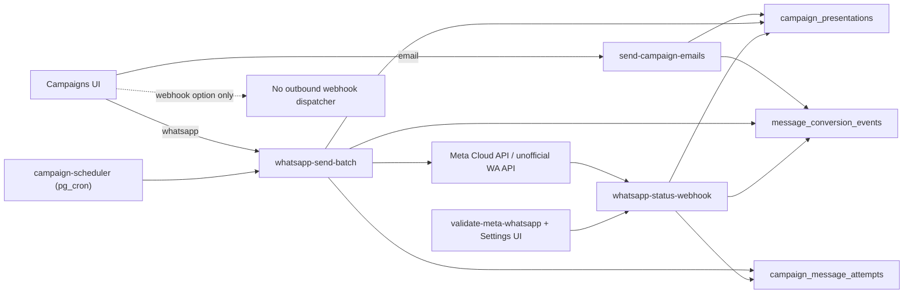

# Architecture Analysis: Campaign Webhook Sending

**Date:** 2026-03-20
**Scope:** `src/pages/Campaigns.tsx`, `src/components/SendPresentationDialog.tsx`, `src/pages/Settings.tsx`, `supabase/config.toml`, `supabase/migrations/20260312023848_453bac75-c945-4b76-8b8b-c14e15f36a0c.sql`, `supabase/migrations/20260313195000_whatsapp_hybrid_conversion.sql`, `supabase/migrations/20260320000002_campaign_scheduler_cron.sql`, `supabase/functions/campaign-scheduler/index.ts`, `supabase/functions/send-campaign-emails/index.ts`, `supabase/functions/whatsapp-send-batch/index.ts`, `supabase/functions/whatsapp-status-webhook/index.ts`, `supabase/functions/validate-meta-whatsapp/index.ts`
**Questions:** Como o sistema trata o envio de campanhas quando o canal eh `webhook`, qual webhook existe de fato, e quais rotas ainda sao apenas placeholder?

## Summary

O canal `webhook` esta exposto no schema e na UI, mas nao ha dispatcher outbound para ele. No fluxo de confirmacao da campanha, o codigo trata apenas `email` e `whatsapp`; quando `webhook` e selecionado, a funcao cai no update final e marca a campanha como `sent` sem disparar nada.

O unico webhook operacional e o callback inbound da Meta/WhatsApp. Ele atualiza `campaign_presentations`, `campaign_message_attempts` e `message_conversion_events`; o scheduler automatico tambem so executa WhatsApp, entao campanhas agendadas de `email` ou `webhook` podem ficar presas em `sending`.

## Tech Stack

- Frontend: React 18 + Vite + TypeScript
- UI: shadcn/ui + Tailwind CSS
- Data access: Supabase client no frontend
- Backend: Supabase Edge Functions em Deno
- Data store: Postgres via Supabase
- Orquestracao: `pg_cron` + `pg_net`
- Providers: Meta WhatsApp Cloud API, Resend, WhatsApp unofficial API

## Architecture Overview

O produto usa um modelo centrado no banco: `campaigns` guarda o estado da campanha, `campaign_presentations` acompanha cada lead dentro da campanha, `campaign_message_attempts` registra cada envio/retry/follow-up e `message_conversion_events` funciona como ledger de conversao.

Ha dois dispatchers reais de saida: `send-campaign-emails` para email e `whatsapp-send-batch` para WhatsApp. O webhook verdadeiro do sistema e o `whatsapp-status-webhook`, que e inbound e apenas reconcilia entregas, leituras e replies. O canal `webhook` de campanha existe hoje apenas como superficie de schema/UI.

### Architecture Diagram

## Component Map

| Component | Responsibility | Notes |
|---|---|---|
| `src/pages/Campaigns.tsx` | Orquestra criacao, preview e confirmacao de campanhas | Aceita `webhook` no formulario, mas o fluxo de confirmacao so trata `email` e `whatsapp`; no final a campanha ainda e marcada como `sent`. |
| `src/components/SendPresentationDialog.tsx` | Envio unitario de uma apresentacao | Exibe `Webhook (em breve)` como botao desabilitado. |
| `supabase/functions/campaign-scheduler/index.ts` | Disparador cron de campanhas agendadas | Claima campanhas `scheduled` e so executa WhatsApp; canais nao-whatsapp sao pulados depois do claim. |
| `supabase/functions/send-campaign-emails/index.ts` | Executor de email | Envia via Resend e grava estado em `campaign_presentations` e `message_conversion_events`. |
| `supabase/functions/whatsapp-send-batch/index.ts` | Executor de WhatsApp | Faz provider routing, retry, follow-up, template mapping e telemetria. |
| `supabase/functions/whatsapp-status-webhook/index.ts` | Webhook inbound da Meta | Valida token/signature, mapeia status e reconcilia tentativas e eventos. |
| `supabase/functions/validate-meta-whatsapp/index.ts` | Helper de setup do webhook | Retorna webhook URL e verify token para a tela de Settings. |
| `src/pages/Settings.tsx` | UI de configuracao da Meta | Mostra/copia webhook URL e verify token. |
| `supabase/migrations/*campaign*` | Schema e cron | Define os enums de canal/status, tabelas de telemetria e o job de cron. |

## Data Flow

1. O usuario cria a campanha em `src/pages/Campaigns.tsx` e escolhe `whatsapp`, `email` ou `webhook`.
2. No envio manual, `confirmSendCampaign` entra apenas em `email` ou `whatsapp`. Se o canal for `webhook`, nao ha branch de envio.
3. Mesmo sem dispatch, o fluxo segue para `campaigns.update({ status: 'sent' })` e mostra sucesso, o que gera um falso positivo operacional.
4. Para WhatsApp agendado, `campaign-scheduler` roda a cada 5 minutos e chama `whatsapp-send-batch`.
5. `whatsapp-send-batch` grava `campaign_presentations`, `campaign_message_attempts` e `message_conversion_events`.
6. A Meta chama `whatsapp-status-webhook`, que atualiza delivery/read/reply e fecha o loop de telemetria.
7. `validate-meta-whatsapp` entrega a URL do webhook para a tela de Settings, onde o usuario copia os valores para a configuracao na Meta.

## Dependencies

- `src/pages/Campaigns.tsx` depende de `invokeEdgeFunction` para acionar `send-campaign-emails` e `whatsapp-send-batch`.
- `supabase/functions/campaign-scheduler/index.ts` depende de `whatsapp-send-batch` e do estado em `campaigns`.
- `supabase/functions/whatsapp-status-webhook/index.ts` depende de `campaign_presentations.provider_message_id` e `campaign_message_attempts.provider_message_id` para reconciliar callbacks.
- `supabase/functions/validate-meta-whatsapp/index.ts` depende de `SUPABASE_URL` e do endpoint `whatsapp-status-webhook`.
- `campaign_presentations` e a tabela de attempts sao o centro da orquestracao; `message_conversion_events` e a saida analitica.

## Patterns and Conventions

- Orquestracao centrada no banco, nao em uma camada de service dedicada.
- Edge functions como comandos side-effecting, nao como API REST tradicional.
- `campaign_presentations` funciona como estado da campanha por lead.
- `campaign_message_attempts` e um log auditavel e quase append-only.
- `message_conversion_events` e o ledger de funil/conversao.
- Frontend e backend duplicam parte da logica de template, score e variante, o que aumenta risco de drift.

## Risks and Tech Debt

| Risk | Severity | Location | Impact |
|---|---|---|---|
| O canal `webhook` existe na UI/schema, mas nao ha dispatcher outbound; o envio manual cai no fim do fluxo e marca a campanha como `sent` sem disparar nada. | High | `src/pages/Campaigns.tsx`, `src/components/SendPresentationDialog.tsx`, `supabase/migrations/20260312023848_453bac75-c945-4b76-8b8b-c14e15f36a0c.sql` | Falso sucesso, perda de confiabilidade e campanhas nao enviadas. |
| O scheduler reivindica qualquer campanha `scheduled` antes de filtrar canal e so executa WhatsApp. Campanhas agendadas de `email` ou `webhook` podem ficar presas em `sending`. | High | `supabase/functions/campaign-scheduler/index.ts`, `supabase/migrations/20260320000002_campaign_scheduler_cron.sql` | Automacao quebrada e estado operacional incorreto. |
| O webhook de status reconcilia apenas tentativas com `provider = meta_cloud`. | Medium | `supabase/functions/whatsapp-status-webhook/index.ts` | Fluxos de provider unofficial nao atualizam delivery/read de forma confiavel. |
| O helper de validacao retorna `verifyToken` para o cliente. | Medium | `supabase/functions/validate-meta-whatsapp/index.ts`, `src/pages/Settings.tsx` | Exposicao desnecessaria de um valor sensivel de configuracao. |
| A logica de preview e a logica de envio real de WhatsApp estao duplicadas entre frontend e edge function. | Medium | `src/pages/Campaigns.tsx`, `supabase/functions/whatsapp-send-batch/index.ts` | Drift entre preview e producao quando templates/variantes mudam. |

## Recommendations

1. **Bloquear ou remover o canal `webhook` ate existir um dispatcher real** (High priority, low effort if gating only)
   - Se o objetivo ainda nao for disparar HTTP outbound, esconda a opcao da UI e valide no backend.
   - Se o objetivo for disparar para um endpoint do cliente, crie uma edge function dedicada com contrato de payload, retries e logging.

2. **Corrigir o scheduler para nao reivindicar campanhas que ele nao sabe executar** (High priority, medium effort)
   - Filtre por canal antes do claim, ou devolva o status para `scheduled` quando o canal nao for suportado.
   - Se email e webhook devem ser agendados, implemente workers especificos para cada canal.

3. **Criar o dispatcher outbound de webhook de campanha** (High priority, medium/high effort)
   - Defina payload versionado, idempotency key, timeout, retry policy e registro em `campaign_message_attempts`.
   - Grave sucesso/falha em `message_conversion_events` para manter o funil observavel.

4. **Fortalecer a configuracao do webhook da Meta** (Medium priority, low effort)
   - Pare de retornar `verifyToken` por padrao; mostre apenas quando necessario ou mantenha o valor apenas no backend.
   - Reforce a validacao da assinatura e documente claramente a configuracao manual na tela de Settings.

5. **Extrair a logica compartilhada de template/variante** (Medium priority, medium effort)
   - Unifique a montagem da mensagem e a selecao de variante entre preview e `whatsapp-send-batch`.
   - Adicione testes para o caso `webhook` e para campanhas agendadas por canal.
