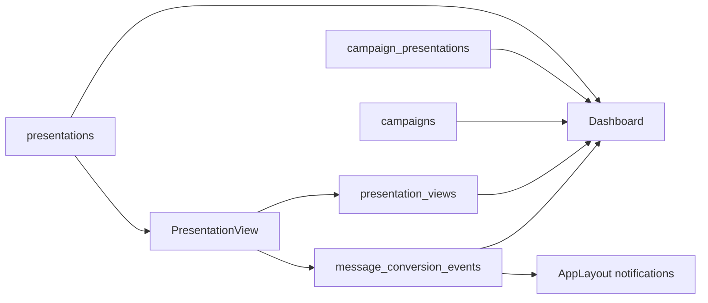

# Architecture Analysis: Commercial Dashboard

**Date:** 2026-03-14
**Scope:** `src/pages/Dashboard.tsx`, `src/pages/Campaigns.tsx`, `src/pages/Presentations.tsx`, `src/components/AppLayout.tsx`, `src/pages/PresentationView.tsx`, `supabase/migrations/20260313195000_whatsapp_hybrid_conversion.sql`
**Questions:** Como transformar a home de um painel operacional do scanner em um dashboard comercial, usando apenas os sinais que a plataforma ja grava hoje?

## Summary

O dashboard anterior lia quase so `presentations` e `presentation_views`, entao mostrava volume e abertura, mas nao o resultado comercial. A base ja possuia telemetria suficiente em `campaign_presentations`, `campaigns` e `message_conversion_events` para montar funil, resposta semanal, comparativo por canal e filas de follow-up sem criar backend novo.

## Tech Stack

- Frontend: React 18 + Vite + TypeScript
- UI: shadcn/ui, Tailwind CSS, Framer Motion, Recharts
- Data access: Supabase client no frontend
- Data store: Postgres via Supabase

## Architecture Overview

O fluxo comercial parte de `presentations`, ganha contexto de envio em `campaign_presentations`, herda canal em `campaigns`, registra visualizacao em `presentation_views` e consolida o funil real em `message_conversion_events`. O sino do header ja consumia esses eventos, o que validava a fonte antes da mudanca no dashboard.

### Architecture Diagram

## Component Map

- `src/pages/Dashboard.tsx`: home do workspace; agora agrega funil, cards de conversao, respostas semanais, canal e filas.
- `src/pages/Campaigns.tsx`: cria campanhas, envia mensagens e grava `sent` em `message_conversion_events`.
- `src/pages/Presentations.tsx`: lista propostas e expoe `lead_response`, pronto para leitura operacional.
- `src/pages/PresentationView.tsx`: ao abrir a proposta, grava `presentation_views` e evento `opened`.
- `src/components/AppLayout.tsx`: consome `message_conversion_events` para notificacoes recentes.
- `supabase/migrations/20260313195000_whatsapp_hybrid_conversion.sql`: introduz telemetria de entrega, abertura, clique e resposta.

## Data Flow

1. Usuario monta proposta em `presentations`.
2. Quando entra em campanha, `campaign_presentations` registra envio, estado de entrega e follow-up.
3. O link publico abre `PresentationView`, que grava `presentation_views` e evento `opened`.
4. Aceite, recusa e cliques viram registros em `message_conversion_events`.
5. O dashboard agrega essas tabelas no frontend e produz os indicadores comerciais.

## Dependencies

- `Dashboard.tsx` depende fortemente de `message_conversion_events` como fonte de verdade do funil.
- `campaign_presentations` continua necessario para fallback de envio, entrega e follow-up.
- `campaigns.channel` e usado para atribuir performance por canal quando o evento chega como `unknown`.
- `presentations.lead_response` serve como fallback para resposta final quando o evento nao existe.

## Patterns and Conventions

- Paginas fazem query direta no Supabase client, sem camada intermediaria de service.
- O produto usa agregacao client-side via `useEffect` + `useMemo`.
- Dashboards e cards combinam `shadcn/ui` com Recharts e animacao leve via Framer Motion.

## Risks and Tech Debt

| Risk | Severity | Location | Impact |
|------|----------|----------|--------|
| Tipos Supabase ainda nao refletem colunas novas de `campaign_presentations` | Medium | `src/integrations/supabase/types.ts` | Mais casts e menor seguranca de tipagem |
| Parte do dashboard depende de fallback entre varias fontes (`events`, `views`, `lead_response`) | Medium | `src/pages/Dashboard.tsx` | Possivel divergencia se alguma trilha parar de gravar |
| Agregacao no cliente pode crescer demais com base grande | Medium | `src/pages/Dashboard.tsx` | Custo de render e queries maiores por usuario |

## Recommendations

1. Atualizar os tipos gerados do Supabase para incluir `delivery_status` e `next_followup_at`.
2. Criar uma view ou RPC de analytics comercial se o volume crescer, reduzindo agregacao no browser.
3. Padronizar `message_conversion_events` como unica fonte de funil, mantendo fallbacks apenas para retrocompatibilidade.
