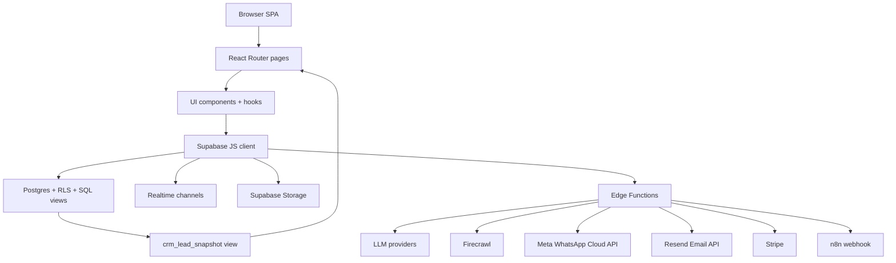

# Architecture Analysis: envPRO End-to-End

**Date:** 2026-03-21
**Scope:** Full product review across `src/`, `supabase/functions/`, `supabase/migrations/`, root configuration, build/test setup, and operational documentation.
**Questions:** Como o produto esta estruturado de ponta a ponta? Quais sao os fluxos principais, as dependencias criticas, os limites atuais de arquitetura e os riscos operacionais para evolucao?
**Time Box:** 90 minutes

## Summary

O projeto e um monolito de produto bem definido: um SPA em React/Vite consome diretamente Supabase para dados e usa Edge Functions para IA, scraping, billing, email, WhatsApp oficial e automacoes de campanha. O produto ja cobre um funil comercial completo, de prospeccao e geracao de proposta ate distribuicao, CRM e cobranca.

O principal problema nao e falta de capacidade funcional, e concentracao excessiva de logica em paginas React grandes e funcoes serverless extensas, somada a controles fracos de tipagem, lint e testes. A base e boa para continuar evoluindo, mas hoje a manutencao depende mais de disciplina manual do que de guardrails tecnicos.

## Tech Stack

- Frontend: React 18, React Router 6, Vite 5, TypeScript, Tailwind CSS, shadcn/ui, Framer Motion, Recharts
- Data and auth: Supabase Postgres, Supabase Auth, Supabase Storage, Supabase Realtime, Supabase Edge Functions
- AI and scraping: Gemini, OpenAI, Groq, Anthropic Claude, Firecrawl
- Commercial channels: Meta WhatsApp Cloud API, Resend, outbound webhook for n8n
- Billing: Stripe Checkout, Customer Portal, Stripe Webhook
- Tests and quality: Node built-in test runner, ESLint, no CI pipeline found
- Deployment signals: SPA routing via `vercel.json`, public webhooks and edge functions configured in `supabase/config.toml`

## Architecture Overview

O produto esta organizado como uma SPA protegida por autenticacao Supabase, com paginas por dominio de negocio. A leitura e escrita de dados simples acontece direto do browser para o banco via Supabase client. Toda integracao com sistemas externos ou processamento mais sensivel fica nas Edge Functions.

Os dominios centrais sao:

- `Scanner`: busca negocios e monta candidatos comerciais
- `Presentation Engine`: analisa negocio, gera HTML da proposta e publica por `public_id`
- `Campaign Orchestrator`: monta campanhas, despacha por email, WhatsApp oficial ou webhook n8n
- `CRM Workspace`: consolida sinais de campanha, visualizacao, resposta e tarefas em uma view SQL
- `Settings and Billing`: concentra identidade da conta, APIs de IA, Firecrawl, WhatsApp oficial, n8n e Stripe
- `Admin and Robot`: area interna de monitoramento e automacao experimental

### Architecture Diagram

### Public/Protected Surface

- Public routes: landing, auth recovery, legal pages, `/presentation/:publicId`, `/form/:slug`
- Protected routes: dashboard, scanner, DNA, presentations, campaigns, CRM, clients, templates, settings, documentation, admin
- Public callbacks: Stripe webhook, WhatsApp status webhook, Meta validation flows, some edge functions with manual auth checks

## Component Map

### Presentation Layer

- `src/App.tsx`: route table and top-level providers
- `src/components/AppLayout.tsx`: shell, sidebar, notifications, plan badge, onboarding
- `src/pages/Index.tsx`: scanner and proposal creation orchestration
- `src/pages/Presentations.tsx`: proposal management, regeneration, public URL handling
- `src/pages/Campaigns.tsx`: campaign CRUD, metrics, preview and manual dispatch
- `src/pages/CRM.tsx`: CRM workspace shell, query-param state, drawers and dialogs
- `src/pages/Dashboard.tsx`: client-side commercial analytics
- `src/pages/Settings.tsx`: account, integrations, billing and provider configuration
- `src/pages/Admin.tsx`: platform-level statistics and admin actions

### Application/Utility Layer

- `src/hooks/useAuth.ts`: auth state, signup/signin/signout
- `src/hooks/useSubscription.ts`: plan loading, quota checks, Stripe actions
- `src/hooks/useCRMWorkspace.ts`: CRM workspace loading, realtime sync and mutations
- `src/lib/invoke-edge-function.ts`: authenticated edge invocation with retry for quota errors
- `src/lib/crm/deriveLeadState.ts`: CRM state derivation and queue heuristics
- `src/lib/presentation-html.ts`: sanitization and asset fallback for public proposal HTML

### Backend/Infrastructure Layer

- `supabase/functions/_shared/auth.ts`: manual auth context for functions
- `supabase/functions/_shared/llm.ts`: multi-provider LLM abstraction
- `supabase/functions/_shared/firecrawl.ts`: Firecrawl key resolution and retry policy
- `supabase/functions/_shared/presentation-renderer.ts`: HTML rendering engine for proposals
- `supabase/functions/search-businesses`: market scanning and business extraction
- `supabase/functions/deep-analyze`: website and Google Maps analysis with Firecrawl + LLM
- `supabase/functions/generate-presentation`: structured proposal generation
- `supabase/functions/send-campaign-emails`: Resend dispatcher
- `supabase/functions/whatsapp-send-batch`: Meta Cloud API dispatcher and follow-up logic
- `supabase/functions/send-campaign-webhooks`: n8n webhook dispatcher
- `supabase/functions/whatsapp-status-webhook`: Meta inbound reconciliation
- `supabase/functions/check-subscription`, `create-checkout`, `customer-portal`, `stripe-webhook`: billing boundary
- `supabase/functions/robot-worker`: experimental asynchronous scanning worker

## Data Model

### Core business entities

- `profiles`: tenant-like user profile plus channel/integration settings
- `company_dna`: reusable commercial context for personalized proposals
- `presentations`: central commercial artifact; stores analysis, HTML, response and pipeline stage
- `campaigns`: campaign container by channel and schedule
- `campaign_presentations`: join table controlling send status and delivery progress
- `message_templates`: reusable campaign copy, variants and Meta template metadata

### Conversion and CRM entities

- `presentation_views`: public presentation opens
- `campaign_message_attempts`: delivery attempt log, provider ids, retries and follow-up state
- `message_conversion_events`: normalized event stream for sent/opened/accepted/rejected/etc.
- `crm_tasks`: follow-up tasks
- `crm_views`: saved CRM filters
- `crm_lead_snapshot`: SQL view consolidating lead state from proposals, campaigns, views and events

### Platform entities

- `plans`: commercial plans and quotas
- `user_ai_api_keys`: per-user AI provider credentials
- `form_schemas` and `form_responses`: public response forms embedded in proposals
- `robot_tasks`: async automation queue
- `api_usage_logs`: estimated provider cost tracking

## Data Flow

### 1. Scanner to proposal generation

1. User searches from `src/pages/Index.tsx`.
2. Frontend calls `search-businesses`.
3. User selects one or more businesses and starts analysis.
4. Frontend loads `company_dna`, `profiles`, `testimonials`, `client_logos`.
5. Frontend calls `deep-analyze` for scraping + AI analysis.
6. Frontend inserts a `presentations` row with status `generating`.
7. Frontend calls `generate-presentation`.
8. HTML and structured content are written back to `presentations` with status `ready`.

### 2. Proposal view to CRM signal

1. Public visitor opens `/presentation/:publicId`.
2. `PresentationView` fetches `presentations` by `public_id`.
3. The page sanitizes HTML and renders it in an iframe.
4. It writes `presentation_views`.
5. It also writes an `opened` event to `message_conversion_events` using URL tracking parameters.
6. If the lead accepts or rejects, `respond-presentation` updates `presentations.lead_response` and writes conversion events.
7. `crm_lead_snapshot` recalculates effective lead state for CRM and dashboard consumption.

### 3. Campaign orchestration

1. User creates a campaign and links pending `presentations` through `campaign_presentations`.
2. Manual send in `Campaigns.tsx` or scheduled send in `campaign-scheduler` chooses the dispatcher by channel.
3. Email uses Resend, WhatsApp uses Meta Cloud API, webhook uses n8n POST.
4. Dispatchers update `campaign_presentations`, insert `campaign_message_attempts` and emit `message_conversion_events`.
5. Meta callbacks reconcile delivery and read status through `whatsapp-status-webhook`.
6. CRM and dashboard read the resulting signals from Postgres.

## Dependency Map

### High fan-in modules

- `profiles`: touched by auth, integrations, billing, public domain config, sender identities and webhooks
- `presentations`: central entity for scanner, proposal view, CRM, dashboard, campaigns and forms
- `message_conversion_events`: source of truth for notifications, CRM heat, dashboard and campaign analytics
- `campaign_presentations`: source of truth for send state, delivery state and follow-up
- `company_dna`: reused in analysis and generation flows

### High fan-out modules

- `src/pages/Settings.tsx`: account, providers, Firecrawl, WhatsApp, billing, n8n, email sender
- `src/pages/Campaigns.tsx`: campaign CRUD, metrics, template logic, dispatch choice, preview, manual fallback
- `supabase/functions/whatsapp-send-batch/index.ts`: template selection, follow-up, retry, tracking, Meta calls and DB reconciliation
- `supabase/functions/_shared/presentation-renderer.ts`: single renderer with many visual responsibilities

### Cross-cutting dependencies

- `src/lib/invoke-edge-function.ts` couples frontend network behavior to Supabase auth session state
- `supabase/functions/_shared/auth.ts` couples edge security to manual header parsing
- `crm_lead_snapshot` couples CRM semantics to event quality in `message_conversion_events`

## Patterns and Conventions

- Monolithic SPA with route-level pages instead of module packages
- Direct Supabase access in the frontend; no dedicated repository/service layer for most DB operations
- Edge functions are the main orchestration boundary for external APIs
- Product logic is split between SQL views, React pages and serverless functions rather than isolated domain modules
- Realtime is used pragmatically for CRM and notification freshness
- User-provided API keys are first-class and resolved dynamically per request
- Manual auth enforcement is used inside functions because many endpoints are configured with `verify_jwt = false`

## Operational State

### Build and validation snapshot

- `npm test`: passes 8 tests
- `npm run build`: passes
- `npm run lint`: fails with 190 errors and 19 warnings

### Tooling posture

- Root `README.md` does not describe the product; it is the Supabase CLI readme
- No `.github/workflows`, `Dockerfile`, `docker-compose.yml` or `.env.example` were found
- `vercel.json` only contains SPA route fallback
- TypeScript is configured with `noImplicitAny: false`, `strictNullChecks: false` and `strict: false`

## Risks and Tech Debt

| Risk | Severity | Location | Impact |
|------|----------|----------|--------|
| Wide public edge-function surface with manual auth checks instead of platform-enforced JWT on most functions | High | `supabase/config.toml`, `supabase/functions/_shared/auth.ts` | Security mistakes become code-level regressions; easy to forget auth consistency on new functions |
| Business logic concentrated in oversized pages and functions | High | `src/pages/Settings.tsx`, `src/pages/Campaigns.tsx`, `src/pages/Dashboard.tsx`, `supabase/functions/whatsapp-send-batch/index.ts` | Harder onboarding, slower changes, higher regression risk |
| Type safety and lint discipline are weak; project compiles but quality gates are not healthy | High | `tsconfig.json`, `tsconfig.app.json`, `eslint.config.js`, broad `any` usage | Regressions surface later, refactors are expensive, static analysis loses value |
| Test coverage is too narrow for the real product surface | High | `tests/` | Core flows such as scanning, generation, billing, CRM state and public response handling are largely untested |
| Analytics and campaign metrics are aggregated in the browser and include N+1 query patterns | Medium | `src/pages/Dashboard.tsx`, `src/pages/Campaigns.tsx` | Performance and query cost degrade with tenant growth |
| Bundle size is already heavy and asset strategy is weak | Medium | Vite build output | Slower loads on low-end devices, worse public presentation experience |
| Project documentation and deploy onboarding are incomplete | Medium | `README.md`, missing CI/env docs | Higher bus factor and slower environment setup |
| Lint scope includes internal `_bmad` templates with missing rule plugins | Low | `_bmad/...`, `eslint.config.js` | Noise masks real application lint failures |

## Recommendations

1. **Harden the auth boundary for edge functions** (High priority, medium effort)
   - Keep public only what is genuinely public: webhooks and unauthenticated public callbacks.
   - Turn `verify_jwt` on for user-facing functions that are currently manually protected.
   - Centralize exceptions and document them in `supabase/config.toml`.

2. **Extract service modules from the highest-risk files first** (High priority, medium effort)
   - Start with `Campaigns.tsx`, `Settings.tsx`, `Dashboard.tsx` and `whatsapp-send-batch/index.ts`.
   - Move orchestration and transformation logic into dedicated modules by domain.
   - Keep pages focused on view state and UI composition.

3. **Rebuild the quality baseline instead of relying on successful builds** (High priority, medium effort)
   - Fix the broken lint scope and exclude internal workflow templates from app linting.
   - Add incremental typing around the campaign, CRM and presentation domains.
   - Stop accepting new `any` in critical files.

4. **Add integration tests for the four critical business flows** (High priority, medium effort)
   - Scanner -> deep analysis -> presentation generation
   - Public presentation open -> response -> CRM update
   - Campaign send by email/WhatsApp/webhook
   - Stripe subscription sync and plan gating

5. **Move heavy analytics aggregation closer to the database** (Medium priority, medium effort)
   - Promote dashboard and campaign metrics into SQL views or RPCs.
   - Remove per-campaign loops and repeated client-side joins where possible.

6. **Create an actual project onboarding package** (Medium priority, low effort)
   - Replace the root `README.md`
   - Add `.env.example`
   - Document required secrets for Supabase, Firecrawl, LLMs, Resend, Meta, Stripe and n8n
   - Add a simple CI pipeline for lint, test and build

7. **Reduce bundle weight before the public surface grows further** (Medium priority, medium effort)
   - Split heavy pages with route-level code-splitting
   - Compress or lazy-load large static assets like login imagery
   - Revisit dashboard and template tooling dependencies if initial route size matters

## Overall Assessment

O produto esta em um estagio funcionalmente avancado e comercialmente coerente. O core de negocio existe e faz sentido: ele prospecta, gera argumento comercial, distribui, mede resposta e organiza follow-up.

O gargalo agora e engenharia de sustentacao. Se a meta e escalar o produto com seguranca, a prioridade deixou de ser adicionar features rapidamente e passou a ser modularizar os dominios mais densos, apertar a fronteira de autenticacao e criar guardrails reais de qualidade.
